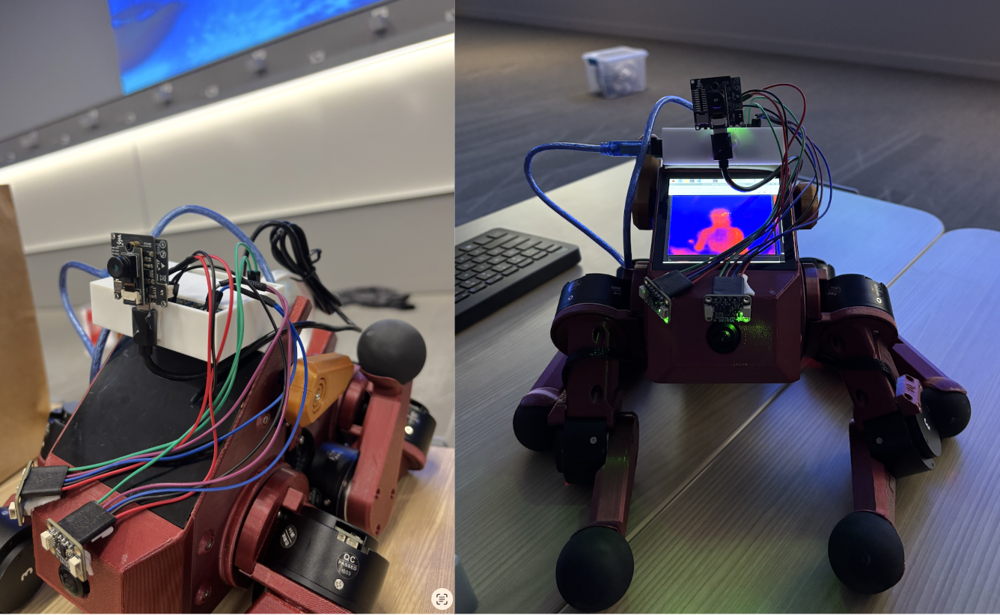

# Rescue Pupper: Autonomous Thermal-Guided Search and Rescue Robot

Stanford University - CS123: A Hands-On Introduction to Building AI-Enabled Robots

<!-- Insert project image here -->


This repository contains the code for Rescue Pupper, an autonomous quadruped robot that uses thermal imaging to locate and navigate toward heat signatures (humans) in search and rescue scenarios.

View our [project presentation](https://docs.google.com/presentation/d/1aVbiru1K8rmNrG0vTwg09F6D1UuEJeRCS3enNGCvNXs/edit?usp=sharing)


[See Rescue Pupper in action!](https://drive.google.com/file/d/1rf32BR1Iuds5kfqpEo8nAXuIIpnnlGV4/view?usp=sharing)

## Project Overview

Rescue Pupper combines thermal imaging with obstacle avoidance to autonomously navigate toward heat sources. The system:

1. **Thermal Tracking**: Continuously monitors thermal images to identify the hottest region (potential human)
2. **Orientation Control**: Rotates to center the heat source in the camera's field of view
3. **Obstacle Avoidance**: Uses sensors to detect and avoid obstacles while navigating
4. **End State Detection**: Stops and celebrates when the target is reached (high percentage of hot pixels)

## Repo Structure

The structure of the repo is as follows:

* `unified_rescue.py`: Main controller that combines thermal tracking and sensor monitoring in a single loop
* `lab_7.py`: ROS2 state machine node for object detection and tracking using YOLO
* `lab_7.launch.py`: ROS2 launch file for robot control and camera systems
* `pupper_llm/`: Contains the Karel robot control interface
  * `karel/karel.py`: High-level robot commands (move, turn, bark, wiggle, dance, etc.)
* `config/`: API key configuration for OpenAI integration
* `sounds/`: Audio files for robot feedback (bark, wiggle, celebration sounds)

## Setup

To get set up, clone the repo:

```bash
git clone https://github.com/armlabstanford/Rescue_Pupper.git
cd Rescue_Pupper
```

### Install Dependencies

```bash
pip3 install -r requirements.txt
```

Key dependencies include:
- `rclpy` (ROS2 Python client)
- `opencv-python` (image processing)
- `numpy` (numerical operations)
- `Pillow` (image loading)
- `pygame` (audio playback)
- `pyserial` (sensor communication)

### Configure API Keys

1. Copy the API key template:
   ```bash
   cp config/api_keys_template.py config/api_keys.py
   ```

2. Edit `config/api_keys.py` and add your OpenAI API key for voice control features.


## Running the System

### Step 1: Launch ROS2 Control System

Start the robot control nodes and camera:

```bash
ros2 launch lab_7.launch.py
```

This launches:
- Robot state publisher
- Neural controller for locomotion
- Camera node for thermal imaging

### Step 2: Run the Rescue Controller

In a separate terminal, run the unified rescue controller:

```bash
python3 unified_rescue.py
```

The controller will:
1. Monitor the `saved_images/` folder for thermal images
2. Identify the hottest region in each frame
3. Rotate to center the heat source
4. Navigate forward while avoiding obstacles
5. Stop and celebrate when the target is reached

### Configuration Parameters

Key parameters in `unified_rescue.py`:

| Parameter | Default | Description |
|-----------|---------|-------------|
| `HOT_PIXEL_THRESHOLD` | 10.0% | Percentage of hot pixels to trigger end state |
| `HOT_PIXEL_INTENSITY_MIN` | 155 | Minimum intensity (0-255) to count as "hot" |
| `CENTER_THRESHOLD` | 0.15 | Offset threshold for "centered" (15% of image width) |
| `SENSOR_PORT` | `/dev/ttyACM1` | Serial port for obstacle sensors |

## System Architecture

```
┌─────────────────────────────────────────────────────────────┐
│                    Rescue Pupper System                      │
└─────────────────────────────────────────────────────────────┘

┌──────────────┐     ┌──────────────┐     ┌──────────────┐
│   Thermal    │────▶│   Unified    │────▶│    Karel     │
│    Camera    │     │  Controller  │     │   Pupper     │
└──────────────┘     └──────────────┘     └──────────────┘
                            │
                            ▼
                    ┌──────────────┐
                    │   Obstacle   │
                    │   Sensors    │
                    └──────────────┘

Navigation Loop:
1. Get thermal image → Find hottest region
2. Calculate offset from center
3. If not centered → Rotate toward heat source
4. If centered → Check for obstacles
   - Obstacle: Move left to avoid
   - Clear: Move forward
5. Repeat until target reached (hot pixels > threshold)
```

## Karel Commands Reference

The `KarelPupper` class provides high-level robot control:

```python
from pupper_llm.karel.karel import KarelPupper

pupper = KarelPupper()

# Movement
pupper.move_forward()
pupper.move_backward()
pupper.move_left()
pupper.move_right()
pupper.turn_left()
pupper.turn_right()
pupper.stop()

# Expressions
pupper.bark()
pupper.wiggle()
pupper.bob()
pupper.dance()

# Object Tracking (Lab 7)
pupper.begin_tracking("person")
pupper.end_tracking()
```
